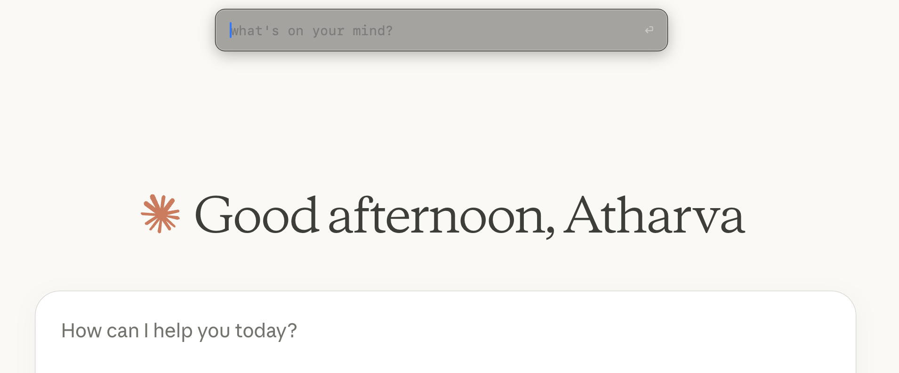
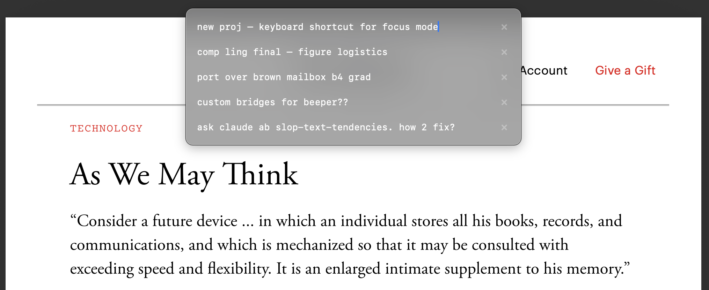

# toodoos

Minimal todos app for MacOS. Cmd+Ctrl+T summons a floating input bar — type a thought, hit enter, it's saved. That's it.

Cmd+Ctrl+T x2 to view, edit, and delete your todos.

  



## Install

Requires macOS 14+ and Swift 5.9+.

```
git clone https://github.com/atharvanihalani/toodoos.git
cd toodoos
./bundle.sh
open ~/Applications/Toodoos.app
```

On first launch, macOS will ask for Accessibility permission (needed for the global hotkey). Grant it.

To start on login: System Settings > General > Login Items > add Toodoos.

## Usage

| Shortcut | Action |
|---|---|
| `Ctrl+Cmd+T` | Open input bar |
| `Ctrl+Cmd+T` x2 | Open todo list |
| `Esc` | Dismiss |
| `Cmd+Delete` | Delete focused todo |
| `Cmd+Z` | Undo delete |
| Arrow keys | Navigate todo list |

Todos are stored as plain markdown in `~/.toodoos.md`. Edit it with whatever you want.
